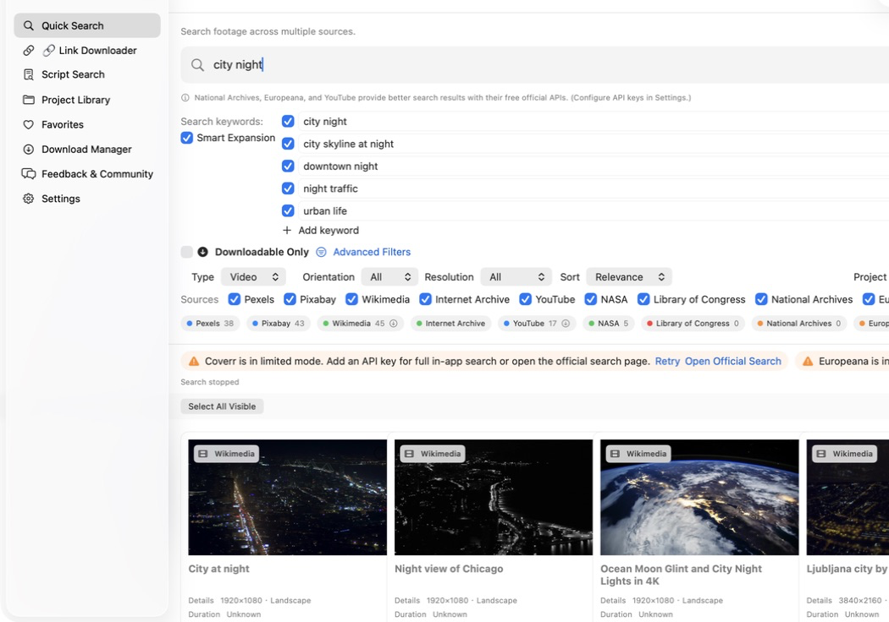
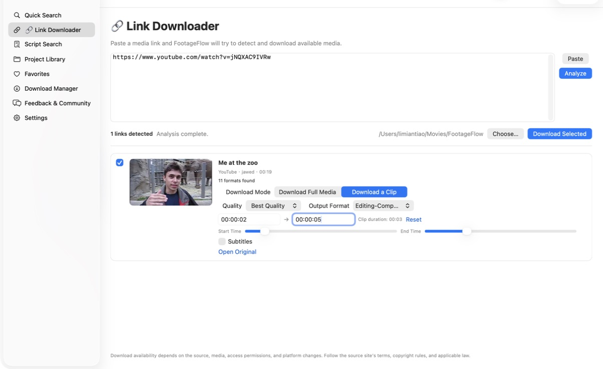
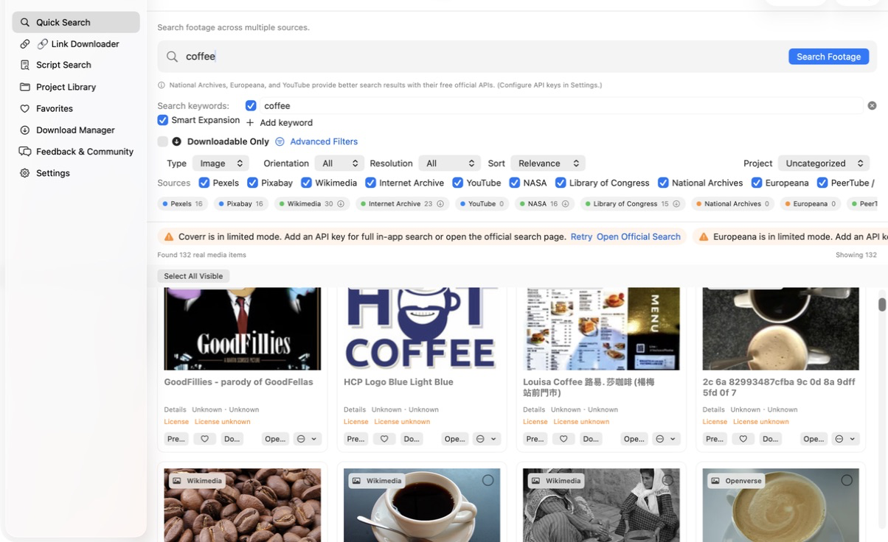
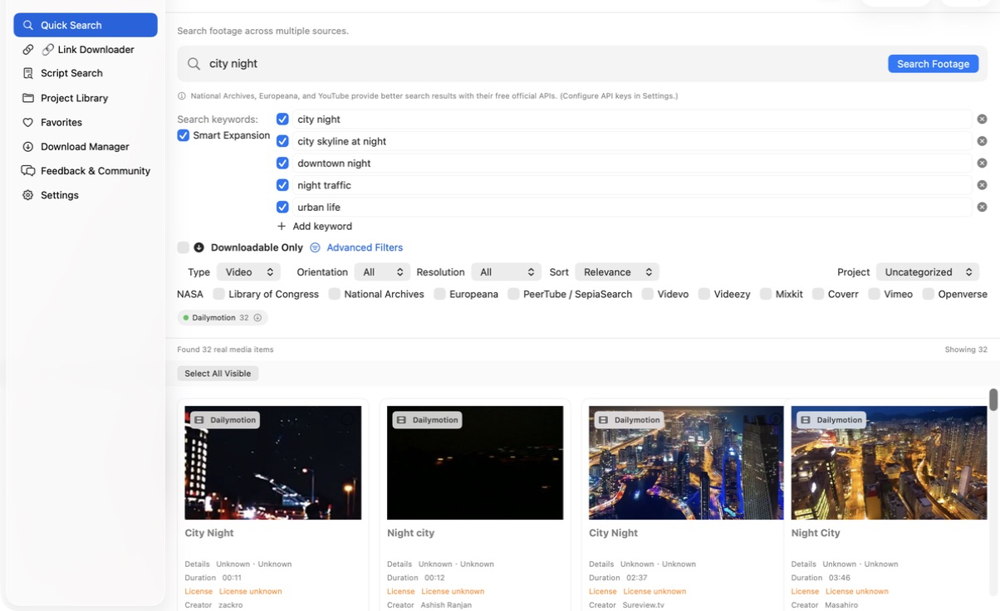
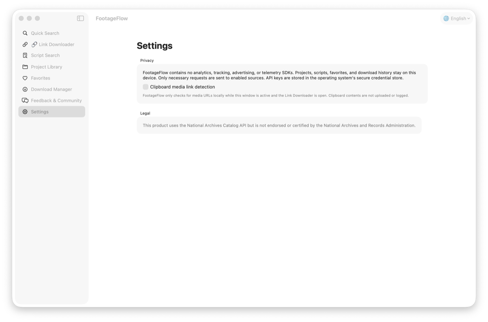
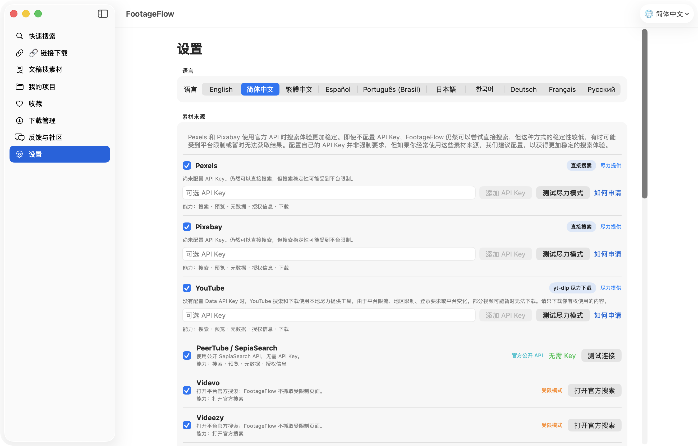
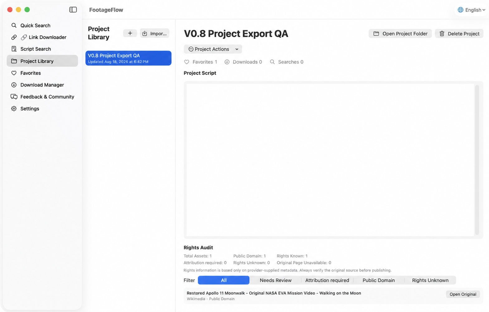
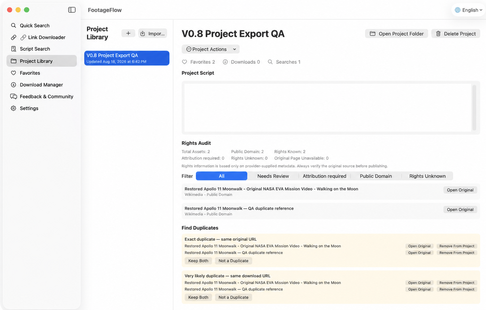

# FootageFlow

[English](README.md) · [简体中文](README.zh-CN.md)

**Search footage. Paste links. Download media.**

A free and open-source desktop app for macOS and Windows that helps video creators search footage across multiple sources and download supported media from pasted links.

[](https://github.com/xcslys99/FootageFlow/releases/latest)
[](https://github.com/xcslys99/FootageFlow/actions/workflows/ci.yml)
[](LICENSE)
[](#install)

**macOS 15+ on Apple Silicon** · **Windows 11 x64** · **Free** · **Open Source**

[Download the latest release for macOS or Windows](https://github.com/xcslys99/FootageFlow/releases/latest) · [All Releases](https://github.com/xcslys99/FootageFlow/releases)

> **Using v0.6.0 or earlier?** Those builds cannot detect new releases. Install the latest version manually once from [GitHub Releases](https://github.com/xcslys99/FootageFlow/releases/latest); v0.7.0 and later can notify you about future stable releases.

## Two ways to use FootageFlow

### 1. Footage Search

Search footage across multiple sources from one place.

- Concurrent multi-provider search with pagination and **Load More**
- Advanced filters, including **Downloadable Only**
- Multi-select and batch download through the Download Manager
- Projects, favorites, search history, and download history
- Provider-supplied source, rights, license, and attribution tracking

### 2. Link Downloader

Paste one or more supported public media URLs and let FootageFlow try to analyze and download the available media.

- Reads metadata, available formats, and subtitles reported by the source
- Downloads full media or a validated start/end clip
- Offers original, audio-only, and editing-compatible MP4 output when available
- Works with YouTube, X/Twitter, Vimeo, Dailymotion, and other public sites supported by the bundled yt-dlp integration
- Sends every task into the same Download Manager with progress, cancellation, retry, history, and source sidecars

Availability depends on the source, individual media, permissions, regional restrictions, authentication requirements, and platform changes. FootageFlow is a best-effort link downloader and does not promise 100% success. See [Link Downloader details](docs/LINK_DOWNLOADER.md).

## Creator workflow

FootageFlow is designed for documentary, history, country profile, finance, science, and social-video research. A typical project can stay inside one application:

1. Search a compound topic in the current interface language.
2. Review and edit the visible queries. FootageFlow keeps the complete topic in ten languages and adds only a small number of visual expansions.
3. Narrow results with relevance mode, source, media type, year, duration, resolution, rights, or direct-download filters.
4. Preview useful items, copy source information, save favorites, or add them to a project.
5. Batch-download available media through the shared queue, or open the original page for discovery-only results.
6. Open **Project Actions** to generate credits, export a source/attribution report, audit rights, make a portable backup, scan duplicates, or create a contact sheet.
7. Keep the generated source sidecars with the project and verify current rights before publishing.

If you already know the media URL, Link Downloader uses the same project, download, history, and sidecar system. Optional foreground-only clipboard detection can recognize copied public media links locally; it is disabled by default and never uploads clipboard contents.

## Screenshots

These screenshots are from FootageFlow on macOS. The Windows edition follows the same product structure with platform-native controls.

















## Features

- Progressive search across 17 sources with Provider failure isolation
- Visible and editable compound queries in ten interface languages, with no paid AI requirement
- Concept-aware local reranking with Precise, Balanced, and Broad modes
- Source, media type, year, duration, resolution, rights, and downloadability filters
- Video/image preview, batch selection, projects, favorites, and history
- Project attribution reports in Markdown, CSV, JSON, and HTML; concise/detailed credits; and rights audit
- Portable `.footageflowproject` backup/import with no bundled media, credentials, or absolute paths
- Local-first duplicate detection and numbered contact-sheet PNG export
- Full-media and clip downloads with original, M4A, or editing-compatible MP4 output
- `.source.txt` and `.source.json` beside every successful download
- Copy Source and Copy Attribution using only Provider-supplied metadata
- Optional API keys stored only in macOS Keychain or Windows Credential Manager
- Local-only clipboard link detection, disabled by default
- English, Simplified Chinese, Traditional Chinese, Spanish, Brazilian Portuguese, Japanese, Korean, German, French, and Russian; English is the first-launch default
- Cross-platform update notifications that never silently install or force an update
- No analytics, advertising, tracking, cloud account, paid LLM, OpenAI API, or Codex dependency

## Install

### macOS

1. Download `FootageFlow-<version>-macOS-arm64.dmg` from the [latest Release](https://github.com/xcslys99/FootageFlow/releases/latest).
2. Open the DMG and drag FootageFlow to Applications.
3. Open FootageFlow. The current build is Ad Hoc signed and not notarized; if macOS blocks the first launch, use **System Settings → Privacy & Security → Open Anyway**.

### Windows

1. On Windows 11 x64, download `FootageFlow-Setup-<version>-Windows-x64.exe` from the [latest Release](https://github.com/xcslys99/FootageFlow/releases/latest).
2. Verify it against the attached `.sha256` file, then run the installer.
3. Open FootageFlow from the Start menu.

The Windows package is self-contained but is not code-signed yet, so SmartScreen may show an unrecognized-app warning. Only continue when the installer came from this repository's official Release and its checksum matches. A portable `FootageFlow-<version>-Windows-x64-portable.zip` is also provided.

No terminal or separate Python, Node.js, Swift, .NET, yt-dlp, or FFmpeg installation is required for normal use.

## Quick start

1. Open FootageFlow and search immediately; API setup is optional.
2. Use **Advanced Filters** or **Downloadable Only** to narrow results.
3. Select cards to download, add to a project, or copy source information.
4. Verify rights on the original source page before publishing.
5. National Archives, Europeana, and YouTube work better with their free official APIs. Optional keys can be added under **Settings → Sources / Providers**.
6. To use a public media URL, open **Link Downloader**, analyze the link, choose an available format, and download it.

Default downloads go to `~/Movies/FootageFlow/<Project>/` on macOS and `%USERPROFILE%\Videos\FootageFlow\<Project>\` on Windows. The root folder is configurable.

## Sources and provider modes

FootageFlow supports 17 sources through a mix of official APIs, public interfaces, limited discovery, and best-effort modes. API keys are optional unless a Provider's official full-search API requires one. One Provider failure never discards successful results from other sources.

The current source set includes Pexels, Pixabay, Wikimedia Commons, Internet Archive, YouTube, NASA, Library of Congress, National Archives, Europeana, PeerTube/SepiaSearch, Videvo, Videezy, Mixkit, Coverr, Vimeo, Openverse, and Dailymotion.

| Access pattern | Sources | What to expect |
|---|---|---|
| Public official interfaces | Wikimedia Commons, Internet Archive, NASA, Library of Congress, Openverse, Dailymotion, PeerTube/SepiaSearch | Search without a user key; item capabilities still vary |
| Optional API + keyless best-effort | Pexels, Pixabay, YouTube | Search without a key where supported; add a key for more stable or complete metadata |
| User key for full in-app search | National Archives, Europeana, Coverr, Vimeo | Add a local key/token or use the official-search action |
| Limited official discovery | Videvo, Videezy, Mixkit | Open the official search or original page; no restricted-page scraping |

Every Provider declares its real search, preview, metadata, rights, pagination, and download capabilities. FootageFlow does not add a Download action merely because a result can be discovered.

See [Provider modes and API behavior](docs/PROVIDERS.md) for the complete capability matrix, API-key behavior, rate-limit handling, and rights metadata rules.

## Software updates

v0.7.0 and later can check the latest stable GitHub Release. v0.7.4 and later check after each outdated app launch, show the real Release Notes, and offer **View Update** or **Not Now**. Not Now applies only to the current session. FootageFlow never downloads, installs, or forces an update. See [Software updates](docs/SOFTWARE_UPDATES.md).

## Rights and source safety

FootageFlow never guesses a license. Missing data stays **Rights / License unknown**, and a successful download does not mean commercial reuse is allowed. Media found through FootageFlow keeps its original copyright and license; the MIT License applies only to this repository's source code.

Always verify the original source page before reuse. See [Rights and attribution](docs/RIGHTS_AND_ATTRIBUTION.md) and [PRIVACY.md](PRIVACY.md).

## Project handoff

Project Actions can export Markdown/CSV/JSON/HTML attribution reports, generate credits, run a Rights Audit, create a portable cross-platform `.footageflowproject` backup, identify likely duplicates, and generate a contact-sheet PNG. Reports exclude local absolute paths by default; backup files never contain media binaries, API keys, cookies, tokens, or absolute paths. Imported media that is not present on the new computer remains in the project and is clearly marked **Local media file not found**. See [Project workflow, export, and attribution](docs/PROJECT_WORKFLOW.md).

FootageFlow has no analytics, advertising, telemetry SDK, or FootageFlow cloud account. Searches are sent only to the enabled Providers required to perform the request. Projects, scripts, favorites, history, and API keys remain on the device; the operating system's secure credential store holds optional keys.

## Troubleshooting quick answers

- **Limited Mode**: add the Provider's optional key for full in-app search, or use **Open Official Search**.
- **Direct search unavailable**: Pexels/Pixabay keyless search is best-effort; retry later or configure the official API.
- **Too many requests**: wait before retrying. FootageFlow respects Provider rate limits.
- **Thumbnail or Download unavailable**: retry the thumbnail when offered, or use **Open Original** when no supported media URL exists.
- **Rights unknown**: verify the original page. FootageFlow never infers permission from a download.
- **Logs**: use **Settings → Open Logs**. Technical logs are redacted and never contain API keys.

See [Troubleshooting](docs/TROUBLESHOOTING.md) for macOS Gatekeeper, Windows SmartScreen, update checks, Link Downloader restrictions, and Provider-specific guidance.

## Documentation

- [Provider modes and API behavior](docs/PROVIDERS.md)
- [Link Downloader](docs/LINK_DOWNLOADER.md)
- [Software updates](docs/SOFTWARE_UPDATES.md)
- [Rights and attribution](docs/RIGHTS_AND_ATTRIBUTION.md)
- [Project workflow, export, and attribution](docs/PROJECT_WORKFLOW.md)
- [Troubleshooting](docs/TROUBLESHOOTING.md)
- [Development guide](DEVELOPMENT.md)
- [Contributing](CONTRIBUTING.md)
- [Roadmap](ROADMAP.md)
- [Changelog](CHANGELOG.md)
- [Security policy](SECURITY.md)

## Feedback & Community

- Bugs → [GitHub Issues](https://github.com/xcslys99/FootageFlow/issues/new?template=bug_report.yml)
- Feature ideas → [GitHub Discussions](https://github.com/xcslys99/FootageFlow/discussions/categories/ideas)
- Questions → [GitHub Discussions Q&A](https://github.com/xcslys99/FootageFlow/discussions/categories/q-a)
- Planned work → [Roadmap Issues](https://github.com/xcslys99/FootageFlow/issues?q=is%3Aissue+is%3Aopen+label%3Aroadmap)

The in-app links never attach credentials, local paths, history, downloads, or project content. Please read the [Code of Conduct](CODE_OF_CONDUCT.md) before participating.

## Build from source

Normal users should install a Release package. Contributors need Swift 6 and full Xcode on macOS. Windows development uses Swift 6.3.3, .NET 10, the Visual Studio 2022 C++ environment, and Inno Setup 7.

```bash
scripts/lint.sh
scripts/secret_scan.sh
swift build -c release
swift test
```

See [DEVELOPMENT.md](DEVELOPMENT.md) for architecture and Provider-extension guidance. Common installation, Provider, thumbnail, download, and update problems are covered in [Troubleshooting](docs/TROUBLESHOOTING.md).
