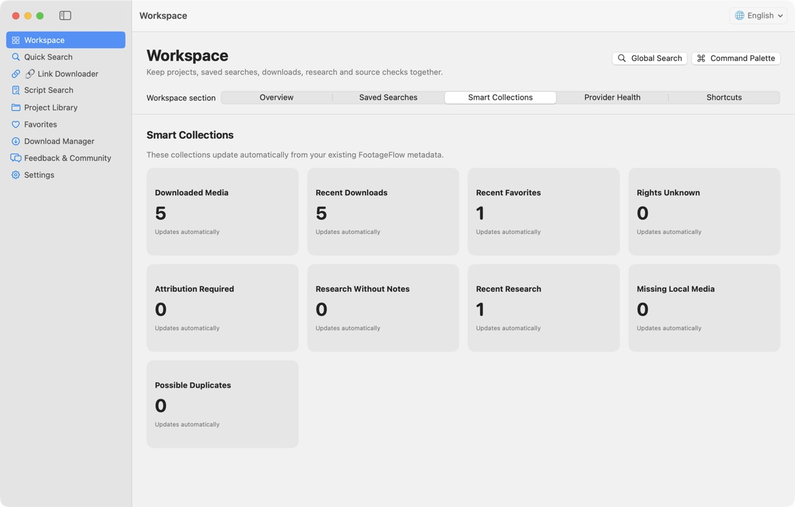
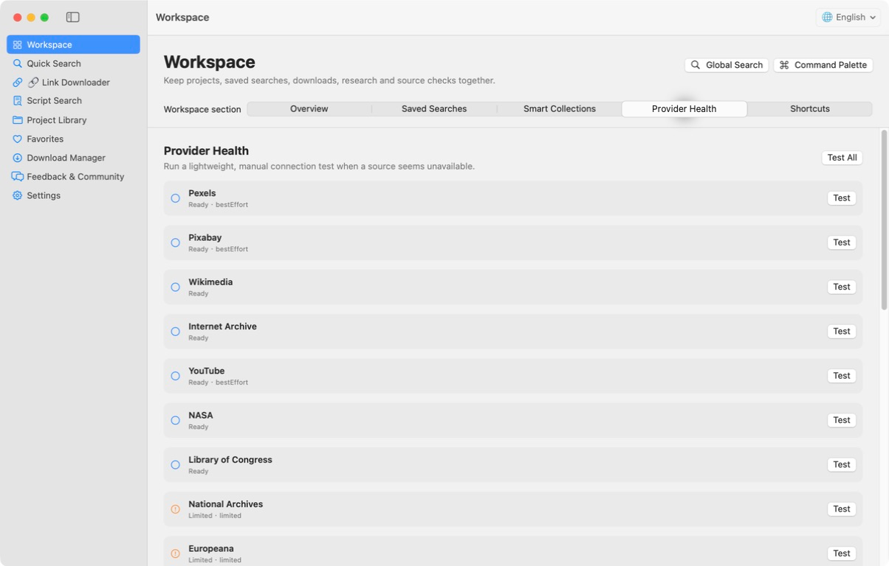
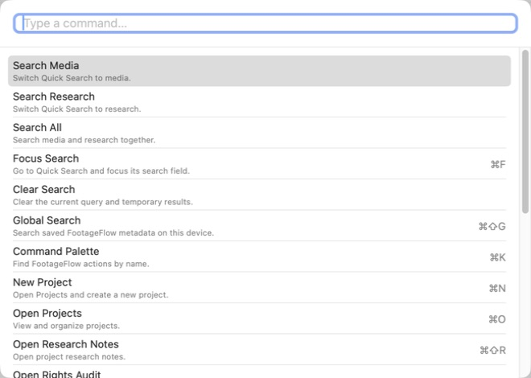

# FootageFlow

[English](README.md) · [简体中文](README.zh-CN.md)

**搜索素材，粘贴链接，下载媒体。**

一款面向视频创作者的免费开源桌面工具，支持 macOS 和 Windows。你既可以一次搜索多个素材来源，也可以粘贴支持的公开媒体链接，尝试解析和下载媒体。

**研究主题、保存资料引用，并将来源与项目统一整理。**

[](https://github.com/xcslys99/FootageFlow/releases/latest)
[](https://github.com/xcslys99/FootageFlow/actions/workflows/ci.yml)
[](LICENSE)
[](#安装)

**macOS 15+ Apple Silicon** · **Windows 11 x64** · **免费** · **开源**

[下载 macOS 或 Windows 最新正式版](https://github.com/xcslys99/FootageFlow/releases/latest) · [查看全部版本](https://github.com/xcslys99/FootageFlow/releases)

> **仍在使用 v0.6.0 或更早版本？** 这些旧版无法检测新版本。请先从 [GitHub Releases](https://github.com/xcslys99/FootageFlow/releases/latest) 手动安装一次最新版；从 v0.7.0 开始，后续稳定版本就可以在应用内提醒。

## FootageFlow 的两种核心用法

### 1. 素材搜索

在一个界面中同时搜索多个素材来源。

- 多 Provider 并发搜索、分页与“加载更多”
- 高级筛选，包括“仅显示可直接下载”
- 多选并通过原有下载管理器进行批量下载
- 项目、收藏、搜索历史和下载历史
- 保存 Provider 实际提供的来源、Rights、License 和署名信息

### 2. 链接下载

粘贴一个或多个支持的公开媒体 URL，让 FootageFlow 尝试解析并下载可用媒体。

- 读取来源实际报告的 Metadata、格式和字幕
- 可下载完整媒体或经过校验的开始/结束片段
- 来源支持时可选择原始输出、仅音频或剪辑兼容 MP4
- 可尝试 YouTube、X/Twitter、Vimeo、Dailymotion 及内置 yt-dlp 支持的其他公开网站
- 所有任务进入同一个下载管理器，支持进度、取消、重试、历史记录和来源 Sidecar
- 粘贴链接下载前可选择所属项目

可用性取决于来源网站、具体媒体、访问权限、地区限制、登录要求以及平台变化。FootageFlow 是尽力提供的链接下载器，不承诺 100% 成功。详见 [链接下载说明](docs/LINK_DOWNLOADER.md)（详细技术文档目前以英文维护）。

## 工作区与无障碍

v0.12.0 已完成已有创作者工作区的键盘与读屏操作链路：

- **命令面板**（macOS `⌘K` / Windows `Ctrl+K`）、全局搜索和键盘优先导航
- 可搜索项目、已保存素材、下载记录、历史、保存搜索和研究笔记的**本地全局搜索**
- **保存搜索**、动态**智能集合**、项目概览统计，以及手动**素材来源状态**检测
- 可仅用键盘操作筛选、结果卡片、项目、下载管理、设置和更新弹窗
- Windows 清晰焦点提示、macOS VoiceOver 语义、Windows Narrator/UI Automation 语义，以及十种语言的无障碍文本
- 更新弹窗默认焦点在“暂不更新”；“查看更新”只打开官方 GitHub Release 页面，绝不会在应用内下载或安装更新

工作区搜索只在本机运行，不扫描任意文件夹，也不会上传项目内容。详见 [工作区说明](docs/WORKSPACE.md)、[键盘快捷键](docs/KEYBOARD_SHORTCUTS.md) 和 [无障碍说明](docs/ACCESSIBILITY.md)（详细技术文档目前以英文维护）。

## 复合搜索相关性

v0.12.1 会在搜索词生成和本地排序中保留复合搜索的每个必要概念。例如，搜索**西安美食**时必须同时关联“西安”和“食物”；搜索**柏林夜景**时必须同时关联“柏林”和“夜景”。即使程序尚未收录某个地点或专有名词，也不会把它丢弃并退化成单独的“美食”或“城市夜景”搜索。

默认的**均衡**模式要求 Provider 返回的元数据能够支持所有必要概念，才会显示结果；只有用户主动选择**宽泛**模式，才会显示弱相关的发现候选。

## 创作者工作流

FootageFlow 面向纪录片、历史、国家、财经、人物、科普和短视频素材研究。一个典型项目可以在同一个应用中完成：

1. 使用当前界面语言输入一个复合主题。
2. 查看并编辑可见搜索词；FootageFlow 会用十种语言保留完整主题，并只加入少量视觉扩展。
3. 使用相关性模式、来源、类型、年份、时长、分辨率、Rights 或直接下载筛选缩小范围。
4. 预览合适素材、复制来源信息、收藏或加入项目。
5. 把可下载素材批量加入共用队列；对仅发现结果打开原始来源页。
6. 打开“项目操作”，即可生成素材署名、导出来源报告、检查版权信息、制作可移植备份、扫描重复素材或生成联系表。
7. 把自动生成的来源 Sidecar 与项目一起保留，并在发布前核对当前授权。

### 研究与文化资料工作区

使用 **素材 / 资料 / 全部**，将媒体发现与资料研究清晰区分。资料模式通过公共接口搜索 Wikipedia、Wikidata、大都会艺术博物馆、芝加哥艺术学院、Crossref 和 GDELT。将记录添加到**研究笔记**后，可以写本地笔记和标签、复制基于真实元数据的引用、稍后刷新来源，或使用**查找相关素材**回到已有的 17 来源素材搜索工作流。

资料记录并不等于已经获得可用素材。Crossref 不会下载论文全文；GDELT 仅用于新闻发现；Wikipedia 缩略图用于资料预览，使用前必须到 Wikimedia Commons 核对具体授权。只有大都会艺术博物馆或芝加哥艺术学院明确返回 Public Domain 和公开原图地址时，才会显示**添加为素材**；绝不根据预览图或页面自行推断。详见[研究与文化资料工作流](docs/RESEARCH_WORKFLOW.md)。

如果已经知道媒体 URL，链接下载会继续使用同一套项目、下载、历史和 Sidecar 系统。可选的前台剪贴板检测可以在本机识别复制的公开媒体链接；该功能默认关闭，不会上传剪贴板内容。

## 界面截图

以下为真实 v0.12.1 macOS 英文界面截图。Windows 版采用相同产品结构，并使用符合 Windows 习惯的原生控件。








## 功能摘要

- 22 个素材来源的渐进式搜索，单个 Provider 失败不影响其他来源
- 十种界面语言的可见、可编辑复合查询，不需要付费 AI
- 精准、均衡、宽泛三种本地概念相关性模式
- 来源、类型、年份、时长、分辨率、Rights 和下载能力筛选
- 视频/图片预览、多选、项目、收藏和历史记录
- 项目来源报告（Markdown、CSV、JSON、HTML）、简洁/详细素材署名和版权信息检查
- 素材 / 资料 / 全部三种搜索模式，支持 Wikipedia、Wikidata、大都会艺术博物馆、芝加哥艺术学院、Crossref 和 GDELT
- 本地研究笔记、基于来源事实的引用、相关素材查询、资料引用导出和项目可移植资料记录
- 可跨平台导入的 `.footageflowproject` 项目备份，不包含媒体、凭据或绝对路径
- 本地优先的重复素材检查与带编号的素材联系表 PNG 导出
- 完整媒体与片段下载，可选原始文件、M4A 或剪辑兼容 MP4
- 每个成功下载文件自动生成 `.source.txt` 和 `.source.json`
- “复制来源”和“复制署名”只使用 Provider 实际提供的元数据
- 可选 API Key 只保存在 macOS Keychain 或 Windows Credential Manager
- 可选的本机剪贴板链接检测，默认关闭
- 支持 English、简体中文、繁體中文、西班牙语、巴西葡萄牙语、日语、韩语、德语、法语和俄语；首次启动默认 English
- 跨平台更新提醒，不会静默安装或强制更新
- 不含分析、广告、跟踪、云端账号、付费大模型，也不依赖 OpenAI API 或 Codex

## 安装

### macOS

1. 从[最新正式版](https://github.com/xcslys99/FootageFlow/releases/latest)下载 `FootageFlow-<version>-macOS-arm64.dmg`。
2. 打开 DMG，把 FootageFlow 拖入“应用程序”。
3. 打开 FootageFlow。当前版本使用 Ad Hoc 签名，尚未公证；如果首次启动被系统拦截，请前往“系统设置 → 隐私与安全性 → 仍要打开”。

### Windows

1. 在 Windows 11 x64 电脑上，从[最新正式版](https://github.com/xcslys99/FootageFlow/releases/latest)下载 `FootageFlow-Setup-<version>-Windows-x64.exe`。
2. 使用同时提供的 `.sha256` 文件核对安装包，然后双击安装。
3. 从“开始”菜单打开 FootageFlow。

Windows 安装包已包含运行组件，但尚未代码签名，因此 SmartScreen 可能提示“无法识别的应用”。请只使用本仓库正式 Release 的安装包，并确认校验值一致。Release 也提供 `FootageFlow-<version>-Windows-x64-portable.zip`。

日常使用不需要终端，也不需要另外安装 Python、Node.js、Swift、.NET、yt-dlp 或 FFmpeg。

## 第一次使用

1. 打开 FootageFlow 后可立即搜索；API Key 设置完全可选。
2. 使用“高级筛选”或“仅显示可直接下载”缩小结果范围。
3. 勾选素材后，可以下载、加入项目或复制来源信息。
4. 发布前必须前往原始来源页核对版权与授权。
5. National Archives、Europeana 和 YouTube 接入官方免费 API 后效果更好；可在“设置 → 素材来源”添加可选 Key。
6. 如果已经有公开媒体 URL，进入“链接下载”解析链接、选择可用格式并下载。

macOS 默认下载目录为 `~/Movies/FootageFlow/<项目名>/`，Windows 默认为 `%USERPROFILE%\Videos\FootageFlow\<项目名>\`，均可在设置中修改。

## 素材来源与 Provider 模式

FootageFlow 通过官方 API、公共接口、受限发现和尽力模式支持 22 个来源。除非某个 Provider 的完整官方搜索本身要求 Key，否则 API Key 都不是首次使用的前置条件。一个 Provider 失败不会清空其他来源的成功结果。

当前来源包括 Pexels、Pixabay、Wikimedia Commons、Internet Archive、YouTube、NASA、ESA Multimedia、Library of Congress、National Archives、Europeana、PeerTube/SepiaSearch、Dareful、Mazwai、DVIDS、British Pathé、Videvo、Videezy、Mixkit、Coverr、Vimeo、Openverse 和 Dailymotion。

| 接入方式 | 来源 | 实际行为 |
|---|---|---|
| 官方公共接口 | Wikimedia Commons、Internet Archive、NASA、Library of Congress、Openverse、Dailymotion、PeerTube/SepiaSearch | 无需用户 Key 即可搜索；具体素材能力仍可能不同 |
| 可选 API + 无 Key 尽力模式 | Pexels、Pixabay、YouTube | 在支持时可无 Key 搜索；配置 Key 后 Metadata 更稳定或完整 |
| 无 Key 直接搜索 | Dareful、ESA Multimedia | Dareful 提供可搜索的公开视频，使用 CC BY 4.0 且需要署名；ESA 仅用于发现，具体素材授权不同 |
| 完整应用内搜索需要用户 Key | National Archives、Europeana、Coverr、Vimeo | 添加本机 Key/Token，或使用“打开官方搜索” |
| 受限官方发现 | Videvo、Videezy、Mixkit、Mazwai、DVIDS、British Pathé | 打开官方搜索或原始页面，不抓取受限制网页，也不绕过访问控制 |

每个 Provider 都声明真实的搜索、预览、Metadata、Rights、分页和下载能力。FootageFlow 不会仅因为能够发现一条结果就添加下载按钮。

完整能力矩阵、API Key 行为、Rate Limit 和 Rights 元数据规则见 [Provider modes and API behavior](docs/PROVIDERS.md)（英文）。

## 软件更新

v0.7.0 及以后版本可以检查最新 GitHub 稳定正式版。v0.7.4 及以后版本会在每次启动旧版时检查、显示真实 Release Notes，并提供“查看更新”和“暂不更新”。“暂不更新”只对当前会话有效。FootageFlow 绝不会静默下载、自动安装或强制更新。详见 [Software updates](docs/SOFTWARE_UPDATES.md)（英文）。

## Rights 与来源安全

FootageFlow 绝不猜测 License。缺少数据时始终显示“版权 / 授权未知”，下载成功也不等于允许商业使用。通过 FootageFlow 找到的媒体继续受原始版权与授权约束；MIT License 只适用于本仓库源码。

使用前必须核对原始来源页。详见 [Rights and attribution](docs/RIGHTS_AND_ATTRIBUTION.md)（英文）及 [PRIVACY.md](PRIVACY.md)。

## 项目交付

“项目操作”支持导出 Markdown/CSV/JSON/HTML 的素材来源、资料引用或综合项目报告；生成素材署名；执行版权信息检查；创建可跨平台导入的 `.footageflowproject` 备份；查找可能重复的素材；以及导出 PNG 素材联系表。报告默认不含本机绝对路径；项目备份绝不包含媒体二进制、API Key、Cookie、Token 或绝对路径。导入到新电脑后找不到的素材会保留在项目中，并清楚显示“未找到本地媒体文件”。详见[项目工作流、导出与署名](docs/PROJECT_WORKFLOW.md)（英文）和[研究与文化资料工作流](docs/RESEARCH_WORKFLOW.md)。

FootageFlow 不含分析、广告或 Telemetry SDK，也没有 FootageFlow 云端账号。搜索只会发送给完成请求所需的已启用 Provider。项目、文稿、收藏、历史和 API Key 保留在本机；可选 Key 由操作系统安全凭据存储保存。

## 常见问题速查

- **显示受限模式**：添加该 Provider 的可选 Key 进行完整应用内搜索，或点击“打开官方搜索”。
- **直接搜索暂不可用**：Pexels/Pixabay 无 Key 搜索属于尽力模式；稍后重试或配置官方 API。
- **请求过于频繁**：等待后再试；FootageFlow 会遵守 Provider Rate Limit。
- **缩略图或下载不可用**：如界面提供可重试缩略图；来源没有兼容媒体 URL 时打开原始页。
- **Rights 未知**：前往原始来源核对；FootageFlow 不会因下载成功而推测授权。
- **日志**：进入“设置 → 打开日志”；技术日志经过脱敏，不会包含 API Key。

macOS Gatekeeper、Windows SmartScreen、更新检查、链接下载限制和 Provider 具体排错见 [故障排查](docs/TROUBLESHOOTING.md)（英文）。

## 文档

- [Provider 模式与 API 行为](docs/PROVIDERS.md)（英文）
- [链接下载](docs/LINK_DOWNLOADER.md)（英文）
- [软件更新](docs/SOFTWARE_UPDATES.md)（英文）
- [Rights 与署名](docs/RIGHTS_AND_ATTRIBUTION.md)（英文）
- [项目工作流、导出与署名](docs/PROJECT_WORKFLOW.md)（英文）
- [工作区](docs/WORKSPACE.md)（英文）
- [键盘快捷键](docs/KEYBOARD_SHORTCUTS.md)（英文）
- [无障碍](docs/ACCESSIBILITY.md)（英文）
- [研究与文化资料工作流](docs/RESEARCH_WORKFLOW.md)（英文）
- [故障排查](docs/TROUBLESHOOTING.md)（英文）
- [开发指南](DEVELOPMENT.md)（英文）
- [参与贡献](CONTRIBUTING.md)（英文）
- [Roadmap](ROADMAP.md)（英文）
- [Changelog](CHANGELOG.md)（英文）
- [安全政策](SECURITY.md)（英文）

## 反馈与社区

- Bug → [GitHub Issues](https://github.com/xcslys99/FootageFlow/issues/new?template=bug_report.yml)
- 功能建议 → [GitHub Discussions](https://github.com/xcslys99/FootageFlow/discussions/categories/ideas)
- 提问 → [GitHub Discussions Q&A](https://github.com/xcslys99/FootageFlow/discussions/categories/q-a)
- 计划工作 → [Roadmap Issues](https://github.com/xcslys99/FootageFlow/issues?q=is%3Aissue+is%3Aopen+label%3Aroadmap)

应用内链接不会附带凭据、本地路径、历史记录、下载记录或项目内容。参与社区前请阅读 [Code of Conduct](CODE_OF_CONDUCT.md)。

## 从源码构建

普通用户应直接安装 Release。macOS 开发需要 Swift 6 和完整 Xcode；Windows 开发需要 Swift 6.3.3、.NET 10、Visual Studio 2022 C++ 环境和 Inno Setup 7。

```bash
scripts/lint.sh
scripts/secret_scan.sh
swift build -c release
swift test
```

架构和新增 Provider 方法见 [DEVELOPMENT.md](DEVELOPMENT.md)。安装、Provider、缩略图、下载和更新问题见 [故障排查](docs/TROUBLESHOOTING.md)（英文）。
