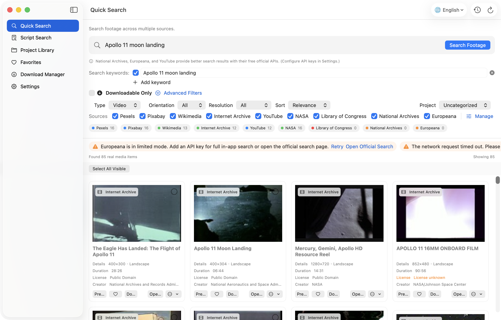
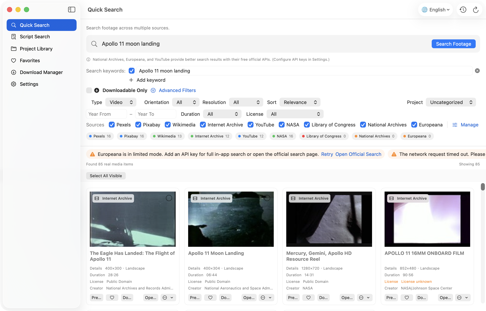
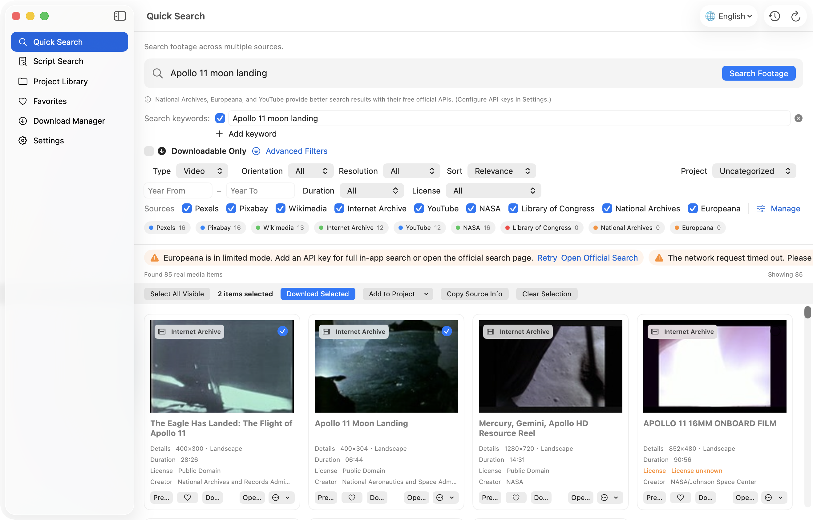

# FootageFlow

[English](README.md) · [简体中文](README.zh-CN.md)

**一次搜索 9 个素材来源。支持 macOS + Windows。免费开源。**

FootageFlow 是一款注重隐私的桌面素材发现、下载与管理软件，面向历史、国家、财经、人物、科普、纪录片和短视频创作者，可搜索真实视频、图片和音频资料。

FootageFlow v0.4.0 正式支持 **macOS 15+ Apple Silicon** 和 **Windows 11 x64**。两个版本共用 Provider 行为、统一 Metadata/Rights、高级筛选、署名文本、关键词、来源 Sidecar 和项目持久化核心。

## 已实现功能

- 并发、逐来源搜索 Pexels、Pixabay、Wikimedia Commons、Internet Archive、YouTube、NASA、Library of Congress、National Archives 和 Europeana
- 按来源、素材类型、年份、时长、分辨率、Rights 和直接下载能力进行高级筛选
- 多选、选择当前可见结果、批量进入原有三并发下载队列、加入项目、重试失败任务、复制来源信息
- 每项均可复制来源或复制署名信息，内容只使用 Provider 实际提供的元数据
- 视频/图片预览、收藏、项目库、文稿拆分、搜索历史和下载历史
- 每个成功下载文件自动生成同名 `.source.txt` 和 `.source.json`
- 支持 English、简体中文、繁體中文、西班牙语、巴西葡萄牙语、日语、韩语、德语、法语和俄语；首次启动仍默认 English
- 搜索栏下方明确提示 National Archives、Europeana 和 YouTube 配置官方免费 API 后效果更好，并可直接进入素材来源设置
- 可选 API Key 只保存在 macOS Keychain 或 Windows Credential Manager
- 不含分析、广告、跟踪、云端账号、付费大模型，也不依赖 OpenAI API、Codex 或终端脚本

配置 Key 后，YouTube 搜索可使用官方 Data API。FootageFlow 也内置本地 yt-dlp，用于尽力搜索和下载公开内容。由于平台限流、地区限制、登录要求、版权限制或接口变化，部分视频可能无法下载。FootageFlow 不读取浏览器 Cookie、不绕过 DRM，也不承诺每个视频都能下载。

## 界面截图

以下截图来自 macOS 版 FootageFlow v0.4.0，展示当前 9 来源搜索、可选 API 建议、高级筛选、批量操作、Provider 模式和 10 种语言界面。Windows 版采用相同产品结构，并使用符合 Windows 习惯的原生控件。








## 在 macOS 安装

1. 从 Releases 下载 `FootageFlow-0.4.0-macOS-arm64.dmg`。
2. 打开 DMG，把 FootageFlow 拖入“应用程序”。
3. 打开 FootageFlow。v0.4.0 使用 Ad Hoc 签名，尚未公证；如果首次启动被系统拦截，请前往“系统设置 → 隐私与安全性 → 仍要打开”。

日常使用不需要打开终端。

## 在 Windows 安装

1. 在 Windows 11 x64 电脑上下载 `FootageFlow-Setup-0.4.0-Windows-x64.exe`。
2. 使用同时提供的 `.sha256` 文件核对安装包，然后双击安装。
3. 完成安装向导，从“开始”菜单打开 FootageFlow。

安装包已包含运行组件，普通用户不需要安装 Python、Node.js、Swift、.NET、yt-dlp 或 FFmpeg。Windows 安装包尚未代码签名，因此 Microsoft Defender SmartScreen 可能提示“无法识别的应用”。请只使用本仓库正式 Release 的安装包，并确认校验值一致。

## 第一次使用

1. 打开 FootageFlow 后可立即搜索；首次启动不要求配置 API Key。
2. 可先尝试 `Apollo 11` 或 `World War II`，再打开“高级筛选”或“仅显示可直接下载”。
3. 勾选结果后，可批量下载、加入现有/新项目或复制来源信息。
4. 发布前使用“复制署名信息”，并核对原始来源页。
5. National Archives、Europeana 和 YouTube 接入官方免费 API 后搜索效果更好；如需配置，请进入“设置 → 素材来源”。

macOS 默认下载目录为 `~/Movies/FootageFlow/<项目名>/`，Windows 默认为 `%USERPROFILE%\Videos\FootageFlow\<项目名>\`，均可在设置中修改。删除数据库记录不会删除已经下载的素材文件。

## 支持来源与 Provider 模式

FootageFlow 不要求所有素材来源采用相同的接入方式。部分平台提供无需 API Key 的公开接口；部分平台在用户配置自己的 API Key 后可以获得更完整和稳定的搜索体验。在技术条件和平台规则允许的情况下，FootageFlow 仍会提供无需 API Key 的受限或尽力搜索模式。

| Provider | 搜索 / API 模式 | 无 Key 模式 | 下载 | Rights 元数据 |
|---|---|---|---|---|
| [Pexels](https://www.pexels.com/api/) | 用户 Key + 官方 API | 直接搜索，尽力提供 | 来源给出媒体地址时可下载 | API 元数据；直接模式可能未知 |
| [Pixabay](https://pixabay.com/api/docs/) | 用户 Key + 官方 API | 直接搜索，尽力提供 | 来源给出媒体地址时可下载 | API 元数据；直接模式可能未知 |
| [Wikimedia Commons](https://commons.wikimedia.org/wiki/Commons:API) | 公共 MediaWiki API | 完整公共接口 | 来源给出原始媒体时可下载 | 来源 `extmetadata` |
| [Internet Archive](https://archive.org/developers/) | 公共搜索和项目元数据 | 完整公共接口 | 按项目文件决定 | 来源提供 License/Rights 时显示 |
| [YouTube](https://developers.google.com/youtube/v3/getting-started) | 用户 Key + Data API | yt-dlp 尽力搜索 | yt-dlp 条件性下载 | 通常无法确认，需核对原始页 |
| [NASA](https://images.nasa.gov/docs/images.nasa.gov_api_docs.pdf) | 官方公开 Images API | 无需 Key | 来源提供官方 Asset 时可下载 | 仅按项目元数据；不自动视为 Public Domain |
| [Library of Congress](https://www.loc.gov/apis/) | 官方公开 JSON API | 无需 Key | 来源给出且未限制的资源 | Rights Advisory/Access 字段 |
| [National Archives](https://www.archives.gov/research/catalog/help/api) | 用户 Key + Catalog API | 受限：打开官方搜索 | 来源给出 Digital Object 时可下载 | 来源限制/Rights 字段 |
| [Europeana](https://europeana.atlassian.net/wiki/spaces/EF/pages/2462351393/Accessing+the+APIs) | 用户 Key + Search API | 受限：打开官方搜索 | 来源给出直接媒体时可下载 | 来源 `edmRights`/rights |

API Key 是开发接口凭据，不等同于平台登录账号。Key 只留在本机、界面默认隐藏，可在“设置 → 素材来源”中添加、替换、测试或删除。Key 不会进入普通设置、日志、源码、Git、Telemetry 或请求 URL。

## Rights 与来源安全

FootageFlow 绝不猜测 Rights 或 License。缺少元数据时显示“版权 / 授权未知”。下载成功不等于允许商业使用。Internet Archive、NASA、Library of Congress、National Archives、Europeana 和 Wikimedia 素材都不会被自动视为 Public Domain。使用前必须核对原始来源页。

This product uses the National Archives Catalog API but is not endorsed or certified by the National Archives and Records Administration.

本项目与列出的素材 Provider 均无隶属或背书关系。请阅读 [PRIVACY.md](PRIVACY.md) 和 [YouTube API 服务条款](https://developers.google.com/youtube/terms/api-services-terms-of-service)。

FootageFlow 源码采用 [MIT License](LICENSE)。通过软件找到的媒体仍受各来源自身的版权和授权条件约束。

## 从源码构建

普通用户应直接安装 Release，无需开发环境。macOS 开发需要 Swift 6 和完整 Xcode；Windows 开发需要 Swift 6.3.3、.NET 10、Visual Studio 2022 C++ 环境和 Inno Setup 7。

```bash
swift build -c release
swift test
scripts/build_app.sh
scripts/verify_app.sh
```

Windows 打包、干净安装、GUI 启动、卸载和 Provider 冒烟验收由 Windows 11 x64 GitHub Actions 执行。架构与新增 Provider 方法见 [DEVELOPMENT.md](DEVELOPMENT.md)。

## 常见问题

- **National Archives/Europeana 显示受限模式**：添加自己的 Key 进行完整应用内搜索，或点“打开官方搜索”。
- **Pexels/Pixabay 直接搜索暂不可用**：稍后重试，或选择添加对应 API Key。
- **请求次数过多**：稍后重试；FootageFlow 不会绕过平台限制。
- **一个 Provider 失败**：其他来源的成功结果仍然可用。
- **没有预览/下载按钮**：来源没有提供兼容的官方媒体地址，请打开原始页。
- **Rights 未知**：以当前原始来源页为准，FootageFlow 不推测使用权限。
- **查看日志**：进入“设置 → 打开日志”。日志不会记录 API Key。
