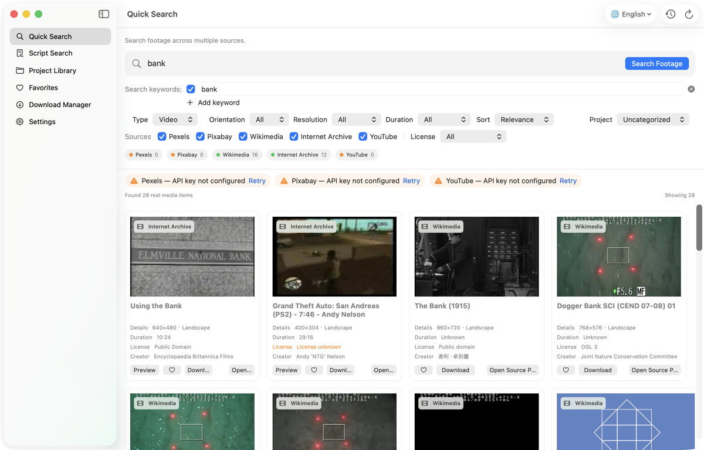
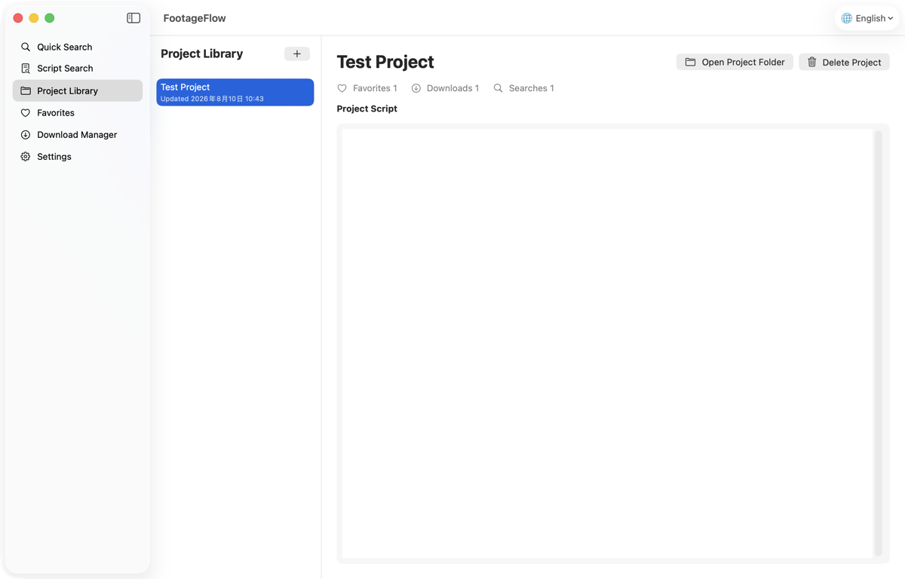

# FootageFlow

[English](README.md) · [简体中文](README.zh-CN.md)

搜索 · 发现 · 下载 · 整理

FootageFlow 是一款注重隐私的桌面素材搜索与管理软件，可一次搜索多个真实视频和图片素材库，适合历史、国家、财经、人物、科普、纪录片和短视频创作。

FootageFlow v0.2.0 正式支持 **macOS 15+ Apple Silicon** 和 **Windows 11 x64**。两个版本共用 Provider、Metadata、License、关键词、来源 Sidecar 和项目持久化核心。

## 已实现功能

- 同时搜索 Pexels、Pixabay、Wikimedia Commons、Internet Archive 和 YouTube
- 显示来源、作者、分辨率、时长，以及 Provider 实际返回的 License 信息
- 筛选、相关度排序、去重、逐平台返回结果和单平台失败提示
- 视频/图片预览、收藏、项目库、文稿拆分和搜索历史
- 下载队列、进度、速度、取消、重试，最多同时下载 3 个素材
- 每个下载文件自动生成同名 `.source.txt` 和 `.source.json`
- English / 简体中文；首次启动默认 English，右上角始终有醒目的语言切换
- 可选 API Key 只保存在操作系统安全凭据存储中
- 不含分析、广告、跟踪、云端账号、付费大模型，也不依赖 OpenAI API、Codex 或终端脚本

配置 Key 后，YouTube 搜索可使用官方 Data API。FootageFlow 还内置本地 yt-dlp，用于尽力搜索和下载公开内容。由于平台限流、地区限制、登录要求、版权限制或平台接口变化，部分 YouTube 视频可能暂时无法下载。FootageFlow 不读取浏览器 Cookie、不绕过 DRM，也不承诺每个视频都能下载。

## 界面截图





## 在 macOS 安装

1. 从 Releases 下载 `FootageFlow-0.2.0-macOS-arm64.dmg`。
2. 打开 DMG，把 FootageFlow 拖入“应用程序”。
3. 打开 FootageFlow。v0.2.0 使用 Ad Hoc 签名，尚未公证；如果首次启动被 macOS 拦截，请前往“系统设置 → 隐私与安全性 → 仍要打开”。

日常使用不需要打开终端。

## 在 Windows 安装

1. 在 Windows 11 x64 电脑上，从 Releases 下载 `FootageFlow-Setup-0.2.0-Windows-x64.exe`。
2. 使用同时提供的 `.sha256` 文件核对安装包，然后双击安装。
3. 完成安装向导，从“开始”菜单打开 FootageFlow。

安装包已包含运行所需组件，普通用户不需要安装 Python、Node.js、Swift、.NET、yt-dlp 或 FFmpeg。Windows 安装包目前没有代码签名，因此 Microsoft Defender SmartScreen 可能显示“无法识别的应用”。请只使用本仓库正式 Release 中的安装包，并在校验值一致后继续。

## 第一次使用

1. 打开 FootageFlow 后可立即搜索；首次启动不要求配置 API Key。
2. Wikimedia Commons 和 Internet Archive 使用公共接口；Pexels 和 Pixabay 未配置 Key 时会尝试直接搜索。
3. 如果经常使用 Pexels 或 Pixabay，可进入 **设置 → 素材来源**，选择添加自己的 API Key，再点 **测试连接**，以获得更稳定的搜索体验。
4. 回到 **Quick Search**，输入题材，检查自动生成的关键词，然后点 **Search Footage**。
5. 如需按项目整理，请先选择项目，再收藏或下载素材。
6. 发布前务必查看每个素材的 License 和原始来源页。

macOS 默认下载目录为 `~/Movies/FootageFlow/<项目名>/`，Windows 默认为 `%USERPROFILE%\Videos\FootageFlow\<项目名>\`，均可在设置中修改。删除数据库中的下载记录不会删除已经下载的素材文件。

## Provider 模式

| Provider | 推荐模式 | 无 Key / 备用模式 | 下载能力 |
|---|---|---|---|
| [Pexels](https://www.pexels.com/api/) | 官方 API（推荐） | 直接搜索（尽力提供） | 来源提供直接媒体地址时可下载 |
| [Pixabay](https://pixabay.com/api/docs/) | 官方 API（推荐） | 直接搜索（尽力提供） | 来源提供直接媒体地址时可下载 |
| [Wikimedia Commons](https://commons.wikimedia.org/wiki/Commons:API) | 公共 MediaWiki API | 公共 API | 按素材元数据决定 |
| [Internet Archive](https://archive.org/developers/) | 公共搜索与元数据接口 | 公共接口 | 按每个项目的文件与授权决定 |
| [YouTube](https://developers.google.com/youtube/v3/getting-started) | 配置后使用 Data API 搜索 | yt-dlp 尽力搜索 | yt-dlp 尽力下载，不保证成功 |

API Key 并非强制要求。即使没有配置 Pexels 或 Pixabay API Key，FootageFlow 仍然可以尝试搜索这些平台。不过直接搜索偶尔可能受到平台限制。如果你经常使用这些素材来源，可以选择配置自己的 API Key，以获得更加稳定的搜索体验。

API Key 是开发接口凭据，不等同于登录账号。Key 只留在本机、界面默认隐藏，并可在 **设置 → 素材来源** 中添加、替换、测试或删除。免费额度、配额和平台规则由各 Provider 决定。

## License 与来源安全

FootageFlow 绝不猜测 License。缺少元数据时会显示“授权未知”。Internet Archive 素材不会被自动视为 Public Domain。使用前请打开原始来源页并核对当前授权条款。

本项目与 Pexels、Pixabay、Wikimedia Foundation、Internet Archive、Google 或 YouTube 均无隶属或背书关系。请阅读 [PRIVACY.md](PRIVACY.md) 和 [YouTube API 服务条款](https://developers.google.com/youtube/terms/api-services-terms-of-service)。

FootageFlow 源代码采用 [MIT License](LICENSE)。通过软件找到的媒体素材仍然受各自来源和 License 约束。

## 从源码构建

普通用户应直接安装 Release，无需开发环境。macOS 开发需要 Swift 6 和完整 Xcode；Windows 开发需要 Swift 6.3.3、.NET 10、Visual Studio 2022 C++ 环境和 Inno Setup 7。

```bash
swift build -c release
swift test
scripts/build_app.sh
scripts/verify_app.sh
```

Windows 打包、干净安装与卸载验收由仓库的 Windows 11 x64 GitHub Actions 执行，具体命令和平台分层见 [DEVELOPMENT.md](DEVELOPMENT.md)。

架构和新增 Provider 方法见 [DEVELOPMENT.md](DEVELOPMENT.md)，参与贡献请阅读 [CONTRIBUTING.md](CONTRIBUTING.md)。

## 常见问题

- **Pexels/Pixabay 直接搜索暂不可用**：稍后重试，或选择添加对应 API Key，切换到更稳定的模式。
- **请求次数过多**：稍后重试；FootageFlow 不会绕过平台限制。
- **一个 Provider 失败**：其他来源的成功结果仍然可以使用。
- **无法预览**：Provider 没有兼容预览流时，请点“打开来源”。
- **License 有疑问**：以原始来源页为准，可刷新搜索获取最新元数据。
- **查看日志**：进入“设置 → 打开日志”。日志不会记录 API Key。
